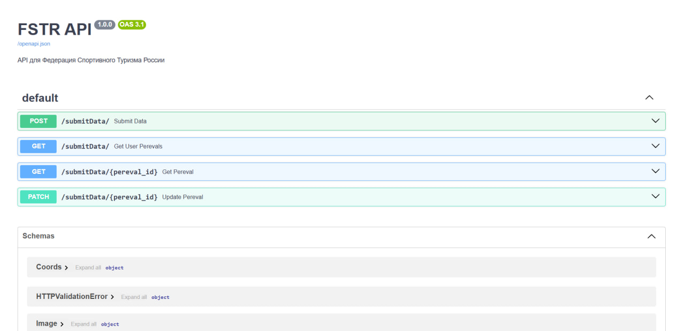

# 🏔️ REST API для Федерация Спортивного Туризма России

FastAPI
PostgreSQL
Python

API для управления данными о горных перевалах с системой модерации.

## 📋 Оглавление
- [Требования](#-требования)
- [Установка](#-установка)
- [Запуск](#-запуск)
- [API Endpoints](#-api-endpoints)
- [Примеры запросов](#-примеры-запросов)
- [Структура БД](#-структура-базы-данных)
- [Тестирование](#-тестирование)
- [Swagger](#-swagger-документация)

## 📝 Требования
- Python 3.9+
- PostgreSQL 13+

## ⚙️ Установка
```bash
git clone https://github.com/Franchesko11/fstr-api.git
cd fstr-api
python -m venv venv
source venv/bin/activate  # Linux/Mac
.\venv\Scripts\activate  # Windows
pip install -r requirements.txt

🚀 Запуск
uvicorn main:app --reload
Сервер будет доступен по адресу: http://localhost:8000

🔌 API Endpoints

🆕 Добавить перевал

POST /submitData/

{
  "user": {
    "email": "user@example.com",
    "fam": "Иванов",
    "name": "Иван",
    "otc": "Иванович",
    "phone": "+79991234567"
  },
  "coords": {
    "latitude": 45.3842,
    "longitude": 7.1525,
    "height": 1200
  },
  "level": {
    "winter": "1A",
    "summer": "1B",
    "autumn": "1A",
    "spring": "1A"
  },
  "images": [
    {
      "data": "base64_encoded_image",
      "title": "Панорама перевала"
    }
  ],
  "beautyTitle": "пер. ",
  "title": "Тестовый перевал",
  "other_titles": "Доп. название",
  "connect": "Соединение"
}


📝 Получить данные о перевале

GET /submitData/{id}
✏️ Обновить данные перевала

PATCH /submitData/{id}
📋 Список перевалов пользователя

GET /submitData/?user__email=user@example.com
🗃️ Структура базы данных


CREATE TABLE users (
    id SERIAL PRIMARY KEY,
    email VARCHAR(255) UNIQUE NOT NULL,
    fam VARCHAR(100) NOT NULL,
    name VARCHAR(100) NOT NULL,
    otc VARCHAR(100),
    phone VARCHAR(20) NOT NULL
);

CREATE TABLE coords (
    id SERIAL PRIMARY KEY,
    latitude FLOAT NOT NULL,
    longitude FLOAT NOT NULL,
    height INTEGER NOT NULL
);

CREATE TABLE pereval_added (
    id SERIAL PRIMARY KEY,
    user_id INTEGER REFERENCES users(id),
    coords_id INTEGER REFERENCES coords(id),
    beauty_title VARCHAR(255) NOT NULL,
    title VARCHAR(255) NOT NULL,
    other_titles VARCHAR(255),
    connect TEXT,
    add_time TIMESTAMP DEFAULT CURRENT_TIMESTAMP,
    status VARCHAR(20) DEFAULT 'new' CHECK (status IN ('new', 'pending', 'accepted', 'rejected')),
    winter_level VARCHAR(2),
    summer_level VARCHAR(2),
    autumn_level VARCHAR(2),
    spring_level VARCHAR(2)
);

CREATE TABLE pereval_images (
    id SERIAL PRIMARY KEY,
    pereval_id INTEGER REFERENCES pereval_added(id),
    image BYTEA NOT NULL,
    title VARCHAR(255)
);


🧪 Тестирование
pytest tests/


📚 Swagger документация
Доступна по адресу: http://localhost:8000/docs


👨‍💻 Разработчики

    Franchesko11

    Поддержка: support@fstr.ru

Скриншот из Swagger (как выглядит API)

!

